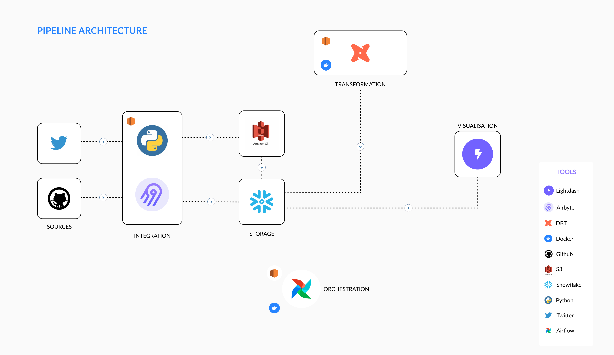
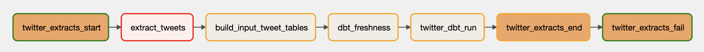
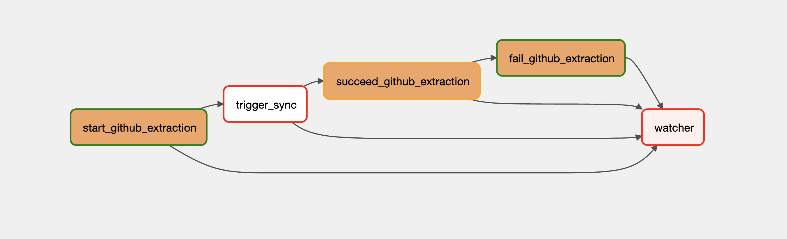
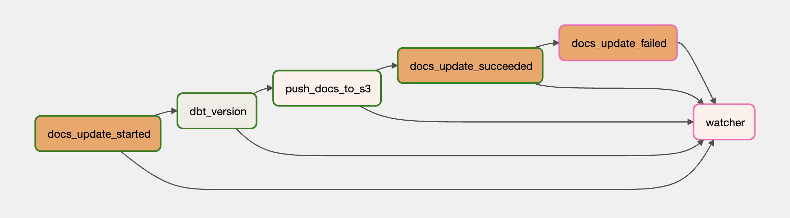
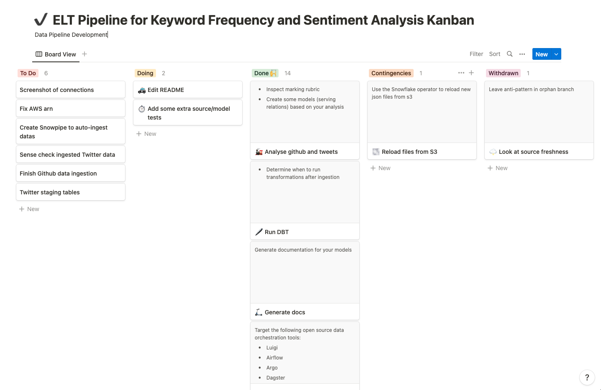
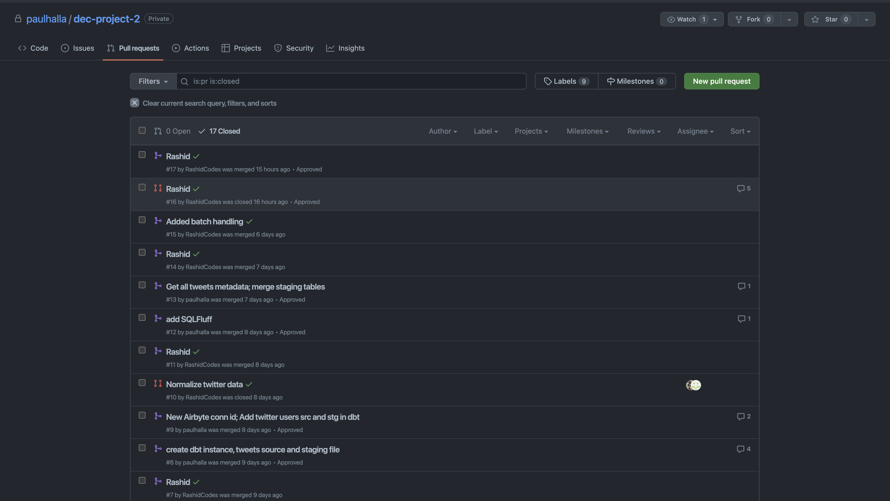

<br/>

<p align="center"><br></p>

<br/>

# Table of Content 
- [Codebase](#code-base)
- [Introduction](#introduction)
- [Research Questions](#research-questions)
- [Data Sources](#data-sources)
- [Solution Architecture](#solution-architecutre)
    - [Orchestration](#orchestration) 
    - [Ingestion](#ingestion)
    - [Transformation](#transformation) 
    - [Semantic Layer](#semantic-layer) 
- [DAGs](#dags)
- [Lightdash Visualizations](#lightdash-visualizations) 
- [Task Assignment](#task-assignment) 
    - [Collaboration](#collaboration)
    - [Project Management](#project-management)
- [Discussions](#discussions)
- [Appedices and References](#appendices-and-references)

<br/>

# Code base

## Code Snippets 
The `code-snippets` folder contains SQL code that was used to build essential objects like **stages**. **integrations**, and **tables**. The snippets are categorised neatly in sub-directories with self-explanatory names. 

## Data Integration 
This folder contains screenshots of connections in the Airbyte.

## Data Orchestration 
This is the main directory of the project. It houses all the airflow DAGs and the dbt projects. 

<br/>


# Introduction
Keyword frequency is defined as how often a keyword appears in a given piece of text or content. It is considered in efforts such as Search Engine Optimsation (SEO) and digital marketing.

Sentiment analysis refers a process that seeks to computationally categorise the opinion expressed in a piece of text to learn the writer's attitude towards a particular subject. Generally, categories considered are *positive*, *negative*, and *neutral*.

The goal of the project was to design and a build a reliable data pipeline for the data science consultancy company, **PRO Inc**. The development of the pipeline was the key to answering some research questions. The owners - Rashid and Paul, allowed a period of three weeks to complete the project.

<br/>


<br/>

# Research Questions 

The research questions categorised by data source are listed below. 

## Twitter data
1. Keyword frequency analysis: How often do data practicioners mention cloud data warehouses and which ones? How often and since when do they mention data space trends such as "data mesh" and "data vault"?
2. Sentiment analysis with regard to data warehouse tools


## GitHub
1. How much activity there is in each of the repositories (counted by, for example trendline for no. of commits in the repository)
2. What languages are mainly used in the each of the repos (Python vs. SQL vs. Java etc)
3. Top contributors in the repos?
4. Many contributors, few commits vs. few contributors, many commits?
5. Location of users etc.

<br/>

# Data Sources 
Several data sources were considered however upon careful consideration, we decided to extract the textual data from **GitHub** and **Twitter**. GitHub and Twitter provide arguably reliable REST API endpoints that can be used to query data. Helpful resources on how to get started with these endpoints are provided in Appendix A. Additionally, the data will be useful for anyone that is interested in trends in the data space, including data practitioners and investors.


## Twitter tweets 
We have extracted the tweets from various data influencers and people who are part of Data Twitter as it's sometimes called colloquially. The list of Twitter users was scraped from Twitter handles featured in the [Data Creators Club site](https://datacreators.club/) by [Mehdi Ouazza](https://github.com/mehd-io), to which other influencers active in the data space were added manually. The list can be found in `data-orchestration/dags/user_data/users.txt`.


## GitHub repo activity dataset via official Airbyte GitHub source  
The dataset includes the GitHub repos of 6 prominent open-source data orchestration tools: 
- Airflow
- Dagster
- Prefect
- Argo
- Luigi
- Orchesto


<br/>


## Transformation 
Both the GitHub and Twitter datasets were transformed to make the data easily accessible. As Twitter data was ingested from JSON files in S3 buckets, the content of the files was flattened such that each row in the target table corresponds to a tweet. For each row, the username of the user who published the tweet was appended in an extra column, which was populated via the username substring available in the ingested filenames. The code used for Snowpipe this transformation can be seen in [this folder](https://github.com/paulhalla/dec-project-2/tree/paulhalla/code-snippets/bulk-load).


<br/>


# Solution Architecutre



## Orchestration 
Pipeline orchestration was performed with **Apache Airflow**. Airflow was run on a `t2.large` EC2 instance using `docker-compose`. The original airflow image had to be extended to include `dbt` in a separate virtual environment. The `Dockerfile` used can be found in the `data-orchestration` directory. 

## Ingestion 
**Airbyte** was used as the data integration tool for the ingestion process. It was selected because it's open source and it's gaining a lot of traction in the data space. Airbyte was used to extract github repo activity data however, a custom python script was developed to extract the tweets of the selected twitter users. The python script can be found in `data-orchestration/dags/tweets_dag/extract_tweets_pipeline.py`.

Our backfill of twitter data started in 2012 - we had about 10 years worth of tweets from requested users. The python script was run daily for about 2 weeks due to the API throttling limits. Thus, if tweets for a particular user were not successfully extracted today, it'll probably be extracted on the next day and so on. This meant that there would be some duplicates in the data. However, deduplication was not a problem since every tweet had a unique identifier. The results of the twitter calls were stored in S3 in JSON format. We used snowpipe as a sensor to sense and ingest any changes in the twitter data files. 

API limits were repeatedly exceeded on a single github token so we tried to "load balance" API calls on 3 separate github tokens, created by each member of the team. This streamlined the ingestion process but it was by no means a permanent fix. After a few replications, we noticed that we had exceeded our limits again. We continued to work on previously ingested data while we waited for the limits to reset.





dbt is then used to transform the ingested data into usable business conformed models.

Lightdash was used in the semantic layer of our pipeline. We chose lightdash but it integrates seamlessly with dbt and it was very trivial set up. 

Replication with Airbyte was performed on a daily basis. 

API limits were perpetually exceeded on a single github token so we tried to "load balance" API calls on 3 separate github tokens, created by each member of the team. This streamlined the ingestion process but it was by no means a permanent fix like we thought it would be. After a few replications, we noticed that we had exceeded our limits again. 


However, we continued work on the data we had ingested prior. Most of the data transformations were performed using dbt by Paul Hallaste. We utilised some conventional best practices in the naming of our models and folder structure. We found that [this](https://docs.getdbt.com/guides/best-practices/how-we-structure/1-guide-overview) guide was very helpful. We learned how modularise our SQL code in a way that scales, how to test models, and lastly some unique considerations like using a `base` folder to house models that'll be joined in the stage. 
## Transformation 
dbt was used to transform the ingested data into usable business conformed models. We utilised some conventional best practices in the naming of our models, folder structure, and model development. We utilised the teachings of a great [guide](https://docs.getdbt.com/guides/best-practices/how-we-structure/1-guide-overview). We learned how to modularise our SQL code in a way that scales, how to test models, and lastly some unique considerations like using a `base` folder to house models that'll be joined in the stage. 


## Semantic Layer
**Lightdash** was used in the semantic layer of our pipeline. We chose lightdash because it integrates seamlessly with dbt and it was very trivial to set up. 


<br/>

# DAGs 

We created three dags for our pipeline:

- **extract_tweets**: 

    *Directory*: `data-orchestration/dags/tweets_dag`

    

    **Figure 1**: Twitter DAG

    The `extract_tweets` DAG was used to perform ELT on the twitter data. It was made up of 7 tasks as shown in the figure 1 above. A DAG run starts by alerting the team in Slack that it's about to start. It then triggers the python script to start the tweet data extraction. If the extraction is successful, we build the raw tweet tables with the `data_community_input` dbt project. The task is skipped if the upstream task fails. The `dbt_freshness` task checks the freshness of the preprocessed tweet data. It is only triggered if all the upstream tasks succeeded. If the last update of the source was at least 2 days ago, this task fails otherwise, it passes. The `twitter_dbt_run` task performs another transformation on the preprocessed data for visualisation. If no upstream tasks failed then the `twitter_extracts_end` task is triggered. It sends a message to the team about a successful run, otherwise, this task is skipped and the `twitter_extracts_fail` task notifies the team of the DAG failure. 

    In the figure 1 above, the DAG failed because we exceeded our monthly API limit for twitter. 

<br/>

- **extract_github_data** 

    *Directory*: `data-orchestration/dags/github_dag`

    

    **Figure 2**: GitHub DAG

    The `extract_github_data` DAG was used to perform ELT on the github repo data. The DAG starts by notifying the team about its start. Subsequently, a replication job in airbyte is triggered with the `trigger_sync` task. If it succeeds, the `succeed_github_extraction` task is triggered. It notifies the team about the successful completion of the replication. However if the `trigger_sync` task fails, the `succeed_github_extraction` task is skipped and `fail_github_extraction` task is triggered. This task notifies the team about the unsuccessful replication of the github data in our snowflake database. Lastly, a watcher task observes each task and is triggered when any of the tasks fails. 

<br/>

- **serve_docs**

    *Directory*: `data-orchestration/dags/dbt_docs_dag` 

    

    **Figure 3**: Serve dbt Documentation DAG

    This DAG updates the dbt documentation website daily. A DAG run begins by notifying the team about its start. The `dbt_docs_generate` task generates the dbt documentation files in the `target` folder of the dbt project. `push_docs_to_s3` is a python task that pushes the files to an S3 bucket with `boto3`. The `docs_update_succeeded` task is only triggered if the upload to s3 was successful. The `docs_update_failed` task is skipped if the upload to S3 was a success. The `watcher` is only triggered if any of the upstream tasks failed. The dbt documentation site is public and can be found [here](http://dec2-dbt-docs.s3-website.us-east-1.amazonaws.com). 

<br/>

# Lightdash Visualizations
<p align="center"><br><em><b>Stars Per Repo - Quarterly</b>: Airflow and Prefect in particular are rising, the latter with a conspicuous spike in Aug 2020. Luigi is the earliest one and is still starred regularly (although less than its competitors)</em></p>

<br/>

<p align="center"><br><em><b>Stars Per Repo - Daily</b>: Prefect spike on Aug 8th 2020 coincides with the <a href=https://medium.com/the-prefect-blog/the-all-new-prefect-server-and-ui-f3141b111b36>launch of Prefect Server and UI</a></em></p>

<br/>

<p align="center"><br><em><b>PRs Per Repo - Monthly</b>: Airflow has the most PRs/month, followed by Dagster. Dagster has a gap between mid 2019 and late 2021, followed by a rapid rise in PRs. Potentially relevantly, in Nov 2021, Dagster <a href=https://medium.com/the-prefect-blog/the-all-new-prefect-server-and-ui-f3141b111b36>announced their series A funding and the launch of Elementl</a> </em></p>

<br/>

<p align="center"><br><em><b>PR Reactions Per Repo</b>: Airflow contributors are a hearty bunch. Prefect contributors like the rocket emoji. Luigi contributors are seemingly outwardly stoic, using little reactions at all.</em></p>


<br/>

# Task Assignment

| Pipeline Stage                             | Member Responsible 
|----------------------------------|------------------- 
| Ingestion                        | Rashid Mohammed
| Transformation and Quality Tests | Paul Hallaste


<br/>

## Project Management 
Project management - task assignment - was managed using **Notion**. The entire project Kanban can be found [here](https://like-piano-930.notion.site/d3f2c7729bf04ed896912c51831e489d?v=4bec58581c444950b42ab5ede25492c5). Project meetings were held on a weekly basis to:
- Make sure team members were on schedule 
- Reschedule tasks were necessary
- Share knowledge



## Collaboration 

GitHub was used to collaboratively work on this project. See Figure 4 below for some of our merge requests.



**Figure 4**: GitHub collaboration

<br/>

# Discussions

## CI/CD 
Towards the end of the project, we tried to implement CI/CD in our pipeline. The services we considered were **CodeDeploy** and **GitHub Actions**. We were able to run integration tests however we failed to deploy the project to our EC2 instance. We ended up creating a cronjob that updates the repo in production every minute. The main con of this approach is config files like `profiles.yml` and ```.env``` have to uploaded to the production server manually every time a change is required. We understand that this does not scale so in our future work, we plan to implement the full CI/CD workflow. 

## Unconventional Patterns 
Conventional usage of dbt preaches the use of staging tables as mirrors of the source. According to the guide in Appendix B, the most standard types of staging model transformations are:
- Renaming 
- Type casting
- Basic computations (e.g. with macros, sql functions, etc)
- Categorisations (e.g. with case statements)

**Joining** challenges the aforementioned pattern. This is because the aim of staging is to prepare and clean source conformed models for downstream usage. Essentially, staging prepares the most useful version of the source system, which we can use as a new modular component for the dbt project. However, there are certain instances where a join is inevitable. In our example, we needed to find the last time our twitter data was updated using snowpipe to check source freshness. Unfortunately, adding a `current_timestamp` column is moot because load times inserted using `current_timestamp` are earlier than the `load_time` values in the `COPY_HISTORY` view (the actual load time). See Appendix C for a full read.

The only way to get the `load_time` values was join on the `COPY_HISTORY` table view. You can find this unconventional pattern in `data-orchestration/dags/dbt/data_community_input`. 


## dbt Documentation 
The dbt documentation site can be improved.

## Local Development 
We could have leveraged tools like [LocalStack](https://localstack.cloud/) to emulate the AWS services for testing.

## Octavia CLI
Few connections were created in this project but as the airbyte connections grow, it'll be better to leverage the capabilities of the [Octavia CLI](https://airbyte.com/tutorials/version-control-airbyte-configurations). 


<br/><br/>

# Appendices and References
## Appendix A

### GitHub REST API
https://docs.github.com/en/rest/guides/getting-started-with-the-rest-api

### Twitter API
https://developer.twitter.com/en/docs/twitter-api/getting-started/getting-access-to-the-twitter-api

## Appendix B
### Staging Table Usage
https://docs.getdbt.com/guides/best-practices/how-we-structure/2-staging

## Appendix C
### Current_timestamps and Load_times in Snowflake 
https://docs.snowflake.com/en/user-guide/data-load-snowpipe-ts.html#load-times-inserted-using-current-timestamp-earlier-than-load-time-values-in-copy-history-view
